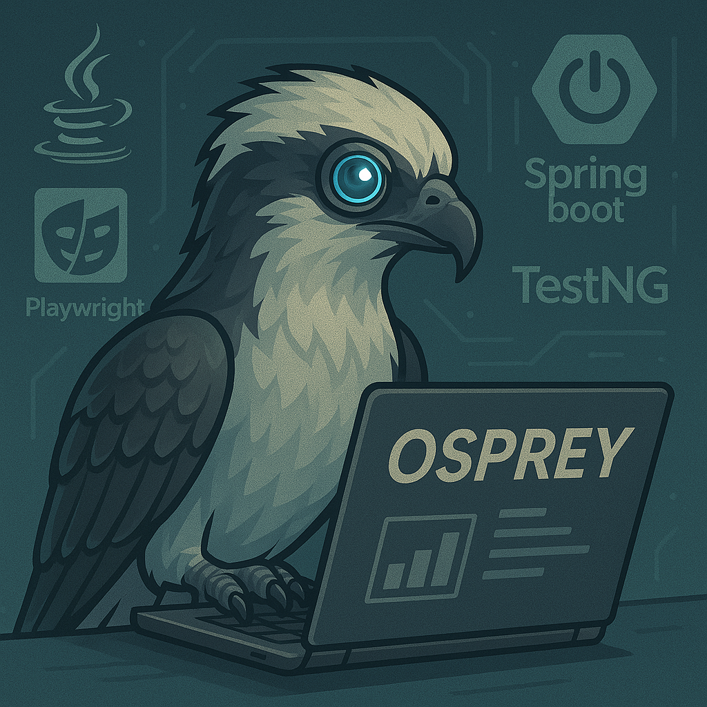

# OSPREY Framework

This framework helps to automate UI and API tests to ensure quality and stability in the application. Osprey framework is using Java, Microsoft Playwright, TestNG and Maven.

## Introduction

TestNG is a testing framework which provide powerful feature for organizing and executing tests efficiently. I have used Microsoft Playwright, powerful tool which enables end to end testing for web apps.

## Features

 - Cross-browser testing support
 - Test Backend services to maintain stability
 - Page Object model (POM) as a design pattern
 - Spring Boot Integration
 - Detailed HTML report via Allure Report
 - Automatic screenshots on failure

## Getting started

 - Install Java(JDK 20 or above) in your system
 - GIT should be installed on your system
 - Install IntelliJ Idea as IDE
 - Clone the project into your IDE and ensure all dependencies are downloaded into .m2 folder

## Tech Stack

 - Java 
 - Spring boot framework
 - Microsoft Playwright
 - TestNG
 - Maven
 - Allure Reports
 - TestNG Asserts

