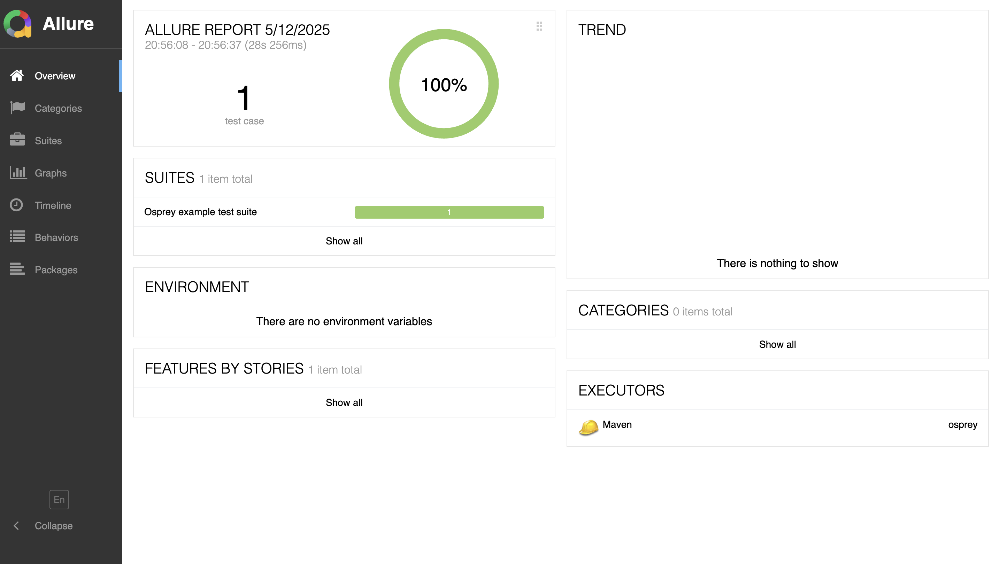

# OSPREY FRAMEWORK

This framework helps to automate UI and API tests to ensure quality and stability in the application. Osprey framework is using Java, Microsoft Playwright, TestNG and Maven.

## Introduction

TestNG is a testing framework which provide powerful feature for organizing and executing tests efficiently. I have used Microsoft Playwright, powerful tool which enables end to end testing for web apps.

## Features

 - Cross-browser testing support
 - Test Backend services to maintain stability
 - Page Object model (POM) as a design pattern
 - Spring Boot Integration
 - Detailed HTML report via Allure Report
 - Automatic screenshots on failure

## Getting started

 - Install Java(JDK 20 or above) in your system
 - GIT should be installed on your system
 - Install IntelliJ Idea as IDE
 - Clone the project into your IDE and ensure all dependencies are downloaded into .m2 folder
 - To execute the test scripts, I prefer to run below maven command with parameters.
 - Add below parameters to run maven command
    1. [ ] **-Dgroups** -- tags or group id for specific test or test case name
    2. [ ] **-DbrowserName** -- browser where you need to execute your test
    3. [ ] **-Dheadless** -- This parameter is specific for local execution
    4. [ ] **allure:report** -- To generate allure report after test execution
 - Example Maven command. 
`mvn test -Dgroups=api_Test -DbrowserName=chrome -Dheadless=true allure:report`

## Test Execution Report

 - To get the allure test report after execution, we to generate the test report by running `allure:report` command.
 - Here in our scenario, we do not need to execute the command separately since we are integrated it with our mvn command
 - After executing `allure:report` command you will find the report under the folder `target/site/allure-maven-plugin`
 - Open the `index.html` file in browser to see the report.

## Tech Stack

 - Java 
 - Spring boot framework
 - Microsoft Playwright
 - TestNG
 - Maven
 - Allure Reports
 - TestNG Asserts

